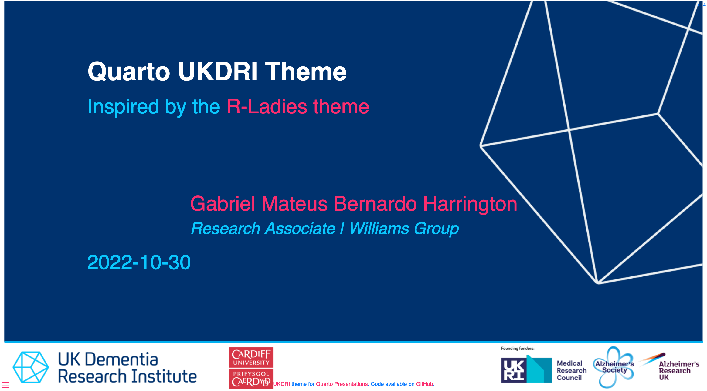

# Quarto UKDRI Theme

This is a repository UKDRI template using `Quarto` `reveal.js` :

<a href='https://github.com/H-Mateus/quarto-ukdri-theme/' target='_blank'>
</a>

The code to create this example is [available here](https://github.com/H-Mateus/quarto-ukdri-theme/blob/main/template.qmd).

## How to install

This [Quarto](https://quarto.org) extension can be installed using the following command:

``` bash
quarto install extension H-Mateus/quarto-ukdri-theme
```

If you are unable to install Quarto extensions, you probably should [update Quarto](https://quarto.org/docs/get-started/).

## How to use it

After you install the template, use the following code on terminal to create a new directory with all files needed:

``` bash
quarto use template H-Mateus/quarto-ukdri-theme
```

```bash
Quarto templates may execute code when documents are rendered. If you do not 
trust the authors of the template, we recommend that you do not install or 
use the template.
```

```bash
 ? Do you trust the authors of this template (Y/n) › Yes
 ? Directory name: › WRITE/THE/DIRECTORY/HERE/talk/
```

```bash
[✓] Downloading
[✓] Unzipping
    Found 1 extension.
[✓] Copying files...

Files created:
 - quarto-rladies-theme.Rproj
 - _extensions
 - talk.qmd

```

## Acknowledgments

- This was forked from the [R-Ladies](https://github.com/beatrizmilz/quarto-rladies-theme) quarto theme
